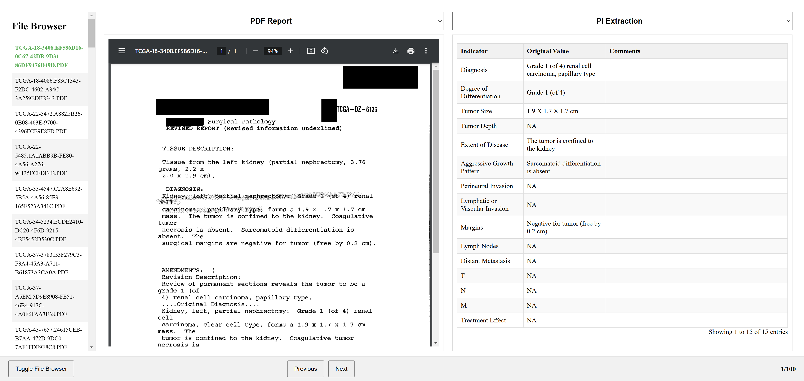

# Pathology Report Evaluation UI

This project is a web-based evaluation interface for pathologists to assess and annotate OCR-processed pathology reports. It displays pathology indicators extracted from the reports and allows users to add comments and annotations to specific indicators. The UI automatically saves annotations and maintains a streamlined workflow for browsing and reviewing multiple reports.



## Features

- **File Browser**: Easily navigate between multiple pathology reports.
- **Split View Display**: View the original PDF report and extracted pathology indicators side-by-side.
- **OCR Text and PI Extraction**: Toggle between OCR text and pathology indicator (PI) extraction views for both containers.
- **Auto-save Annotations**: Annotations are automatically saved when navigating to a different report.
- **Progress Tracking**: Displays the current progress in the report evaluation workflow.

## Project Structure

```
.
├── static/
│   ├── styles.css         # CSS styling for the UI
│   └── script.js          # Main JavaScript file for front-end logic
├── templates/
│   └── splitView.HTML     # HTML template for the main UI
├── server.py              # Flask backend server to handle data requests and saving
└── README.md              # Project documentation
```

## Installation

1. **Clone the Repository**:
   ```bash
   git clone <repository-url>
   cd pathology-report-evaluation
   ```

2. **Set Up Virtual Environment**:
   ```bash
   python3 -m venv venv
   source venv/bin/activate  # On Windows, use `venv\Scripts\activate`
   ```

3. **Install Requirements**:
   ```bash
   pip install -r requirements.txt
   ```

4. **Set Up AWS Credentials**:
   - Create a `.env` file in the root directory with your AWS credentials:
     ```
     AWS_ACCESS_KEY_ID=<your-access-key-id>
     AWS_SECRET_ACCESS_KEY=<your-secret-access-key>
     AWS_DEFAULT_REGION=<your-region>
     ```

5. **Run the Server**:
   ```bash
   python server.py
   ```

6. **Open the Webpage**:
   - Navigate to `http://127.0.0.1:5000` in your browser to access the UI.

## Configuration

### Environment Variables

- `AWS_ACCESS_KEY_ID`: Your AWS Access Key for accessing S3.
- `AWS_SECRET_ACCESS_KEY`: Your AWS Secret Key for accessing S3.
- `AWS_DEFAULT_REGION`: AWS region where the S3 bucket is hosted.

### S3 Bucket Setup

The project requires the following folder structure in your S3 bucket:
- `TCGA_SCC_pdf_selected/`: Contains the PDF files of the pathology reports.
- `TCGA_SCC_pdf_selected_OCR/`: Contains OCR text files for each PDF, with filenames ending in `_textract_v1.txt`.
- `TCGA_SCC_pdf_selected_PI/`: Contains JSON files for each pathology report, with pathology indicators and initial values.

## Usage

1. **Navigating Reports**:
   - Use the File Browser on the left to navigate through the list of pathology reports.
   - The "Previous" and "Next" buttons in the footer can also be used to move sequentially between reports.

2. **Viewing Options**:
   - Each container has a dropdown to toggle between viewing the PDF, OCR text, or pathology indicators.

3. **Annotating Pathology Indicators**:
   - Add comments directly into the "Comments" column for each pathology indicator. Comments are automatically saved when switching to another report.

## Development Notes

- **Auto-Save Annotations**: Annotations are saved automatically to the original JSON file on S3 whenever the user navigates away from the current report.
- **Backend**: The project uses Flask to handle data retrieval from S3 and save updated JSON files.
- **Deployment**: The project can be deployed on platforms like Render or AWS Elastic Beanstalk. Ensure the `PORT` environment variable is set correctly for platform compatibility.

## Known Issues & Troubleshooting

- **Cannot Access S3**: Ensure that your AWS credentials in `.env` are correct and that your IAM user has `AmazonS3FullAccess` permissions.
- **UI Doesn’t Load PDF/OCR Text**: Check the file structure in S3 and confirm that filenames are consistent with the requirements.
- **DataTables Initialization Error**: If you encounter this error when reloading data, make sure that DataTables is properly initialized and destroyed in `script.js`.


